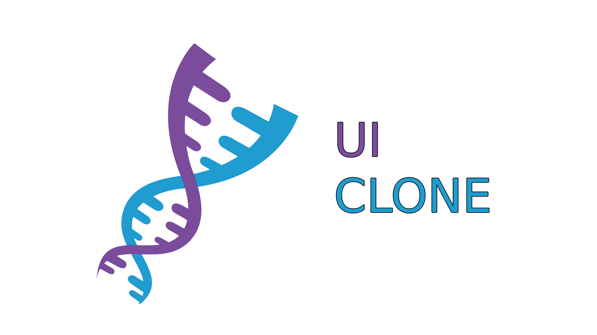

<h1 align="center">
  
   
</h1>

# 💻 Sobre este repositório

Este repositório contém todos os links de todos os UI Clone que desenvolvi até o momento. Cada um deles, tem o próprio **README**, detalhando como foi implementado cada projeto.

___

# 📮 Repositórios 

* [Homepage do Google](https://github.com/raphabarreto/google-homepage-clone)
* [Homepage do Pinterest](https://github.com/raphabarreto/pinterest-clone)
* [Tesla](https://github.com/raphabarreto/tesla-homepage-clone)
* [Typeform](https://github.com/raphabarreto/typeform-homepage-clone)
* [Twitter](https://github.com/raphabarreto/twitter-clone)
* [Stripe](https://github.com/raphabarreto/stripe-menu-clone)
* [Discord](https://github.com/raphabarreto/discord-clone)
* [Mercado Livre](https://github.com/raphabarreto/mercadolivre-clone)
* [Twitch - Mobile](https://github.com/raphabarreto/twitch-mobile-clone)
* [Instagram](https://github.com/raphabarreto/instaclone)
* [Skylab - Plataforma de ensinos da Rocketseat](https://github.com/raphabarreto/skylab-login-clone)
* [Linkedin](https://github.com/raphabarreto/linkedin-clone)
* [Github](https://github.com/raphabarreto/github-clone)
* [Dropbox](https://github.com/raphabarreto/dropbox-clone)
* [Pipefy](https://github.com/raphabarreto/pipefyclone)

___

# 🚀 Tecnologias

Todos esses projetos foram desenvolvidos com as principais tecnologias:

- [React](https://reactjs.org)
- [React Native](https://reactnative.dev/)
- [TypeScript](https://www.typescriptlang.org/)
- [Styled Components](https://styled-components.com/)

---
# 🤔 Como contribuir

- Navegue no repositório escolhido;
- Faça um fork do repositório desejado;
- Cria uma branch com a sua feature: `git checkout -b minha-feature`;
- Faça commit das suas alterações: `git commit -m 'feat: Minha nova feature'`;
- Faça push para a sua branch: `git push origin minha-feature`.

Depois que o merge da sua pull request for feito, você pode deletar a sua branch.

---

## 🧾 Licença

Esse projeto está sob a licença MIT. Veja o arquivo [LICENSE](LICENSE.md) para mais detalhes.

---

Feito com 💗 by [Raphael Barreto](https://bit.ly/contato-linkedin) graças à [Rocketseat](https://rocketseat.com.br/)
